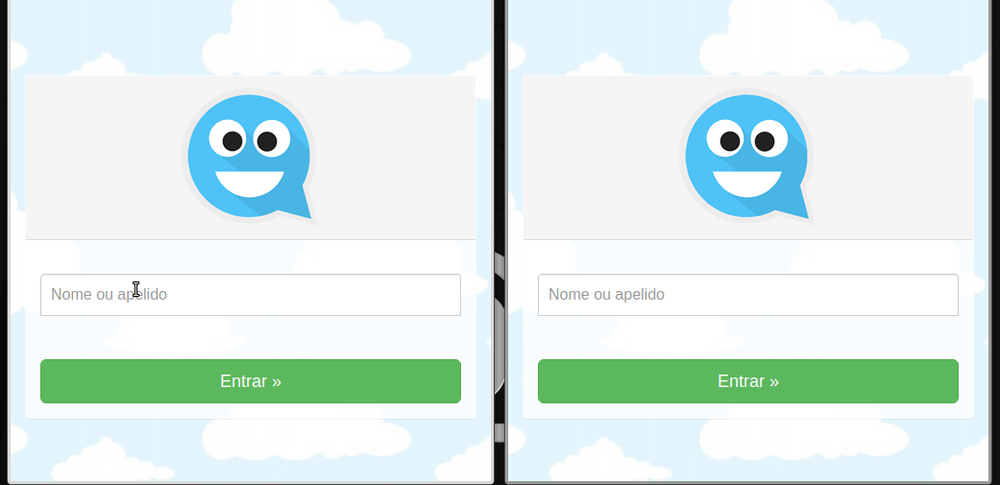
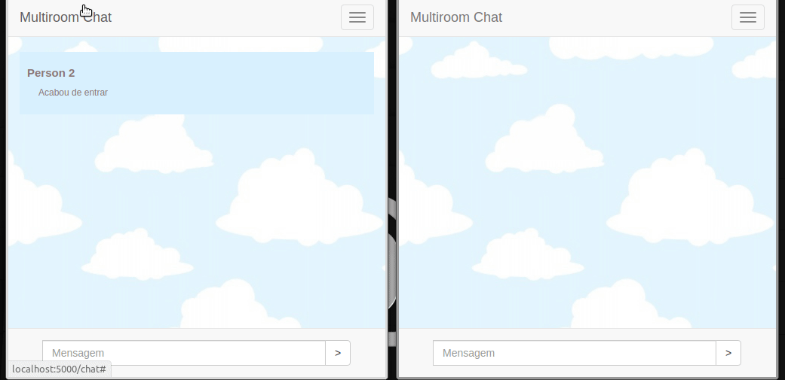
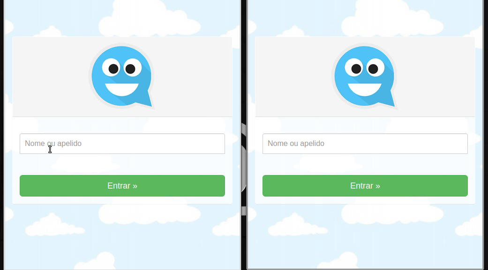

# Chat Node.js

<a href='https://github.com/shivamkapasia0' target="_blank"></a>
<a href='https://github.com/shivamkapasia0' target="_blank"></a>
<a href='https://github.com/shivamkapasia0' target="_blank"></a>


## Main features
### Enter chat

### Chatting

### Validations


### Prerequisites

* [GIT](https://git-scm.com/)
* [Node](https://nodejs.org/en/)
* [Npm](https://www.npmjs.com/)
or
* [Node](https://yarnpkg.com/)


## Getting Started

Clone the repository
```
git clone https://github.com/EmersonBraun/chat_node
```

### Install the dependencies

```bash
npm install
```
or if you use yarn
```bash
yarn
```

## Authors

* **Emerson Braun** - *Initial work* - [EmersonBraun](https://github.com/EmersonBraun)

## License

This project is licensed under the MIT License - see the [LICENSE.md](LICENSE.md) file for details

